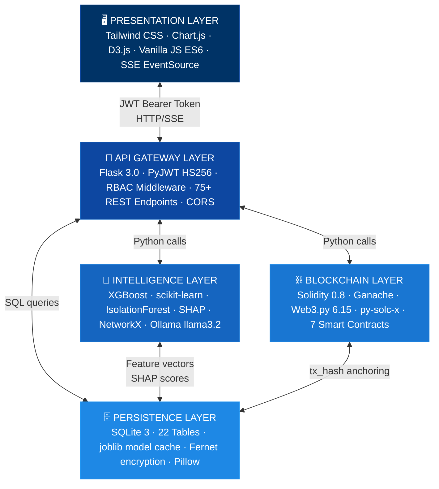
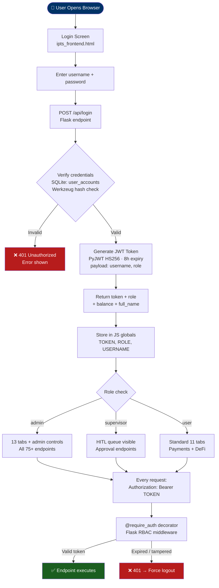
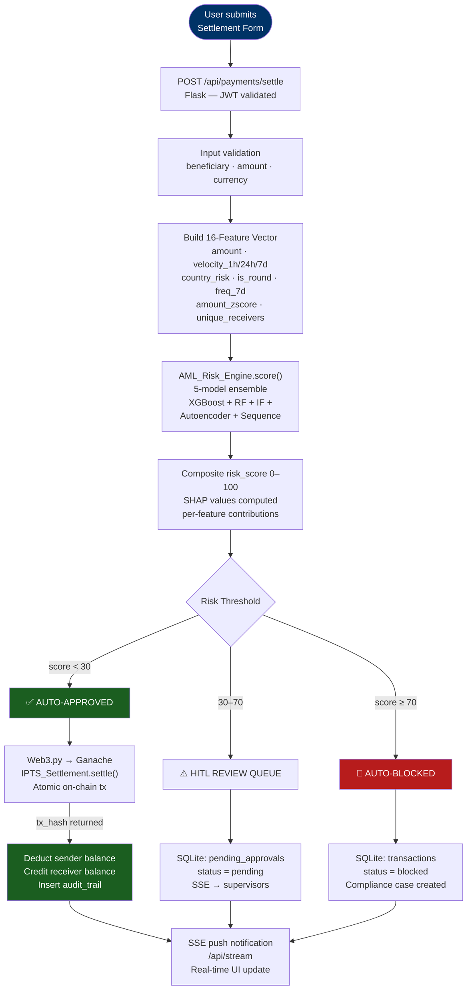
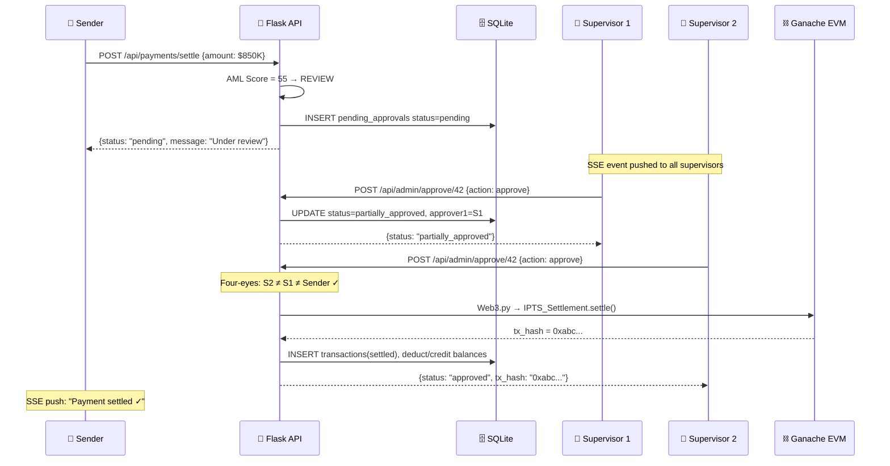
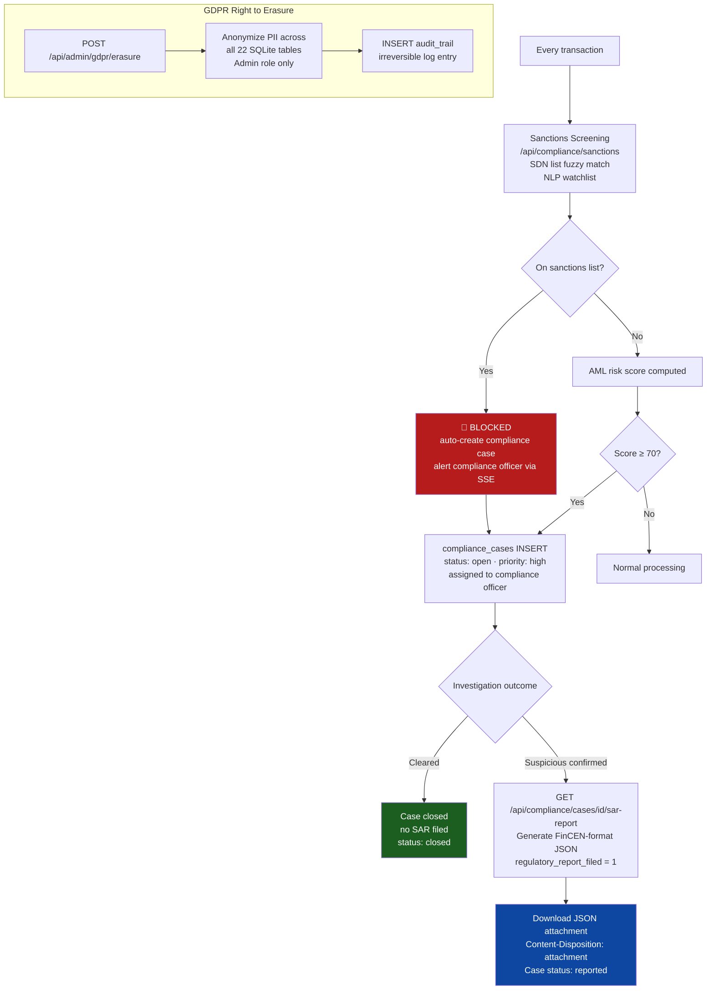
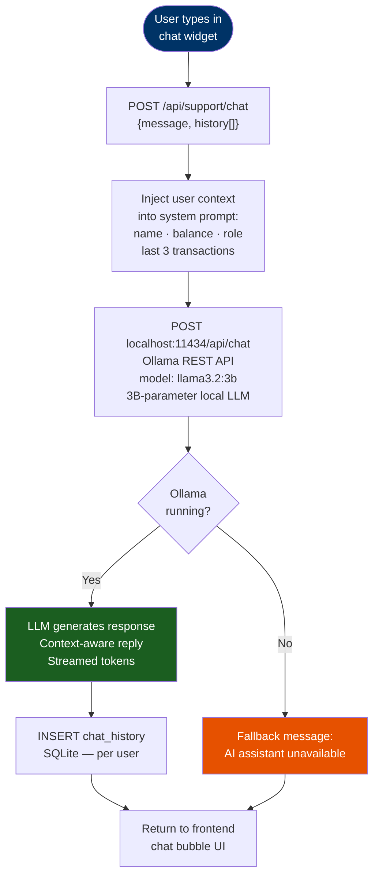
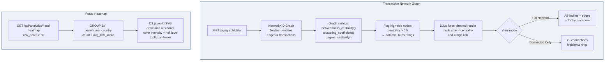
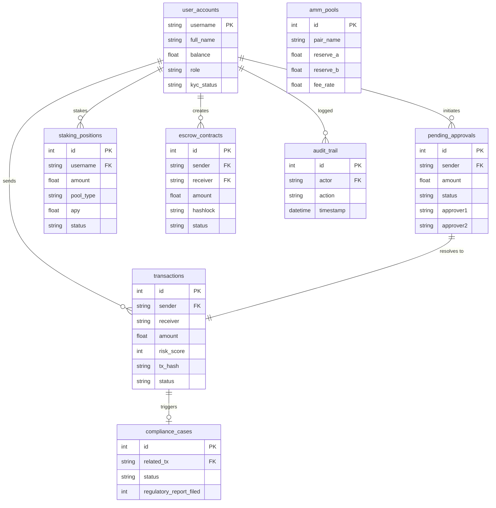

# G9-IPTS — Integrated Payment Transformation System

<div align="center">


[](https://python.org)
[](https://soliditylang.org)
[](https://flask.palletsprojects.com)
[](https://web3py.readthedocs.io)
[](LICENSE)

**A 7-Layer Convergent Architecture for Real-Time Cross-Border Settlements**

*Collapsing T+5 settlement cycles to under 10 seconds using blockchain, explainable AI/ML fraud detection, and Zero Trust security.*

[Quick Start](#-quick-start) · [Architecture](#-architecture) · [Features](#-features) · [API Reference](#-api-reference) · [User Guide](#-user-guide)

</div>

---

## Team — Group 9

| Name | Role |
|------|------|
| **Mohamad Idriss** | Lead Architect & Full-Stack Engineer |
| **Rohit Jacob Isaac** | Blockchain & Smart Contract Engineer |
| **Sriram Acharya Mudumbai** | AI/ML & Data Science Engineer |
| **Walid Elmahdy** | Compliance & Security Engineer |
| **Vibin Chandrabose** | Frontend & Integration Engineer |

---

## Overview

IPTS is an enterprise-grade payment transformation platform that demonstrates how modern fintech infrastructure can achieve near-instant cross-border settlements while maintaining regulatory compliance (AML/KYC/GDPR) and institutional-grade security.

The system integrates:
- **Ethereum Smart Contracts** — 7 Solidity contracts for atomic T+0 settlement with immutable audit trails
- **5 AI/ML Models** — Isolation Forest, Random Forest, XGBoost, Autoencoder, and Sequence Detector with a 16-feature vector including real-time velocity tracking
- **SHAP Explainability** — Per-transaction explainable AI using TreeExplainer with RF fallback, providing 16-feature contribution breakdowns
- **Four-Eyes Dual Approval** — Two independent compliance officers required for transactions >= $100K
- **Multi-Currency FX Engine** — 13 currencies with live rates, FX preview, and AML jurisdiction warnings
- **Zero Trust Architecture** — JWT-based session management with RBAC and rate limiting
- **GDPR-Compliant Data Sovereignty** — Off-chain PII vaulting with on-chain hash anchoring
- **SLA Tracking** — Severity-based countdown timers (Critical 4h, High 24h, Medium 72h, Low 7d)
- **Health Monitoring** — 30-second polling of all system components with visual status indicator
- **Real-Time Dashboard** — SSE-powered live telemetry with 13 functional tabs and Proof of Reserve indicator
- **Notification Center** — Real-time push notifications via SSE with bell badge and dropdown panel
- **Support Chat Bot (LLM)** — AI-powered chat using local Ollama/Llama 3.2 with user context injection
- **Virtual Card Services** — Generate, freeze, cancel, and provision Visa/MC cards to digital wallets
- **Spending 360 Analytics** — Comprehensive spending reports with charts, trends, and beneficiary rankings
- **E-KYC Verification** — Animated 3-phase identity verification with confidence scoring
- **DeFi Hub** — DEX/AMM with constant-product pricing across 6 liquidity pools, 3-tier yield staking (3.5-8.1% APY), and HTLC programmable escrow
- **7 Payment Channels** — Settlement, P2P, ACH/Wire/SEPA, Scheduled, QR Pay, AMM Swap, HTLC Escrow
- **Fraud Heatmap** — Global risk hotspot visualization with country-level analytics
- **SAR Auto-Generation** — Automated FinCEN-format Suspicious Activity Reports from compliance cases
- **ML Model Caching** — Models persist to disk; skip training on subsequent startups

---

## Table of Contents

- [Architecture](#-architecture)
- [Workflow Diagrams](#-workflow-diagrams)
- [Features](#-features)
- [Quick Start](#-quick-start)
- [Installation](#-installation)
  - [System Components](#system-components)
  - [Step 1 — Prerequisites](#step-1--prerequisites)
  - [Step 2 — Install Ganache](#step-2--install-ganache)
  - [Step 3 — Copy the Project](#step-3--copy-the-project)
  - [Step 4 — Python Environment](#step-4--set-up-python-environment)
  - [Step 5 — Node Dependencies](#step-5--install-node-dependencies)
  - [Step 6 — Pull the AI Model](#step-6--pull-the-ai-model)
  - [Step 7 — Fix the Path](#step-7--fix-the-path-in-restartsh)
  - [Step 8 — First Run](#step-8--first-run)
  - [Step 9 — Verify](#step-9--verify-everything-works)
  - [What NOT to Copy](#what-not-to-copy)
  - [Installation Checklist](#installation-checklist)
- [User Accounts](#-user-accounts)
- [User Guide](#-user-guide)
- [API Reference](#-api-reference)
- [AML Risk Engine](#-aml-risk-engine)
- [AI/ML Models](#-aiml-models)
- [Smart Contracts](#-smart-contracts)
- [Security](#-security)
- [Tech Stack](#-tech-stack)
- [Project Structure](#-project-structure)
- [Troubleshooting](#-troubleshooting)
- [License](#-license)

---

## Architecture

IPTS implements a **7-Layer Convergent Architecture**, where each layer handles a specific domain concern:

```
+-------------------------------------------------------------+
|  LAYER 1 - Presentation & Integration                       |
|  SPA (Tailwind CSS, Chart.js, D3.js), SSE Dashboard         |
|  Multi-Currency Forms, SHAP Charts, SLA Tracking, Health     |
+-------------------------------------------------------------+
|  LAYER 2 - Zero Trust Security Perimeter                    |
|  JWT HS256 Auth, Rate Limiting, RBAC (5 roles)              |
|  Four-Eyes Dual Approval, Security Headers, CORS            |
+-------------------------------------------------------------+
|  LAYER 3 - Cognitive Intelligence (AI/ML)                   |
|  5-Model Ensemble: IF, RF, XGB, AE, Sequence Detector      |
|  16-Feature Vector, VelocityTracker, SHAP Explainability    |
|  NLP Watchlist Screening, Graph Centrality Analysis          |
+-------------------------------------------------------------+
|  LAYER 4 - Compliance & Regulatory Engine                   |
|  AML/KYC Screening, HITL Triage with SLA, Case Management  |
|  SAR Filing, Sanctions List, SWIFT GPI, FX Engine           |
+-------------------------------------------------------------+
|  LAYER 5 - Settlement & Blockchain Core                     |
|  7 Ethereum Smart Contracts (Solidity ^0.8.0)               |
|  Atomic Swaps, Nostro/Vostro, Multi-Sig, Compliance Oracle  |
+-------------------------------------------------------------+
|  LAYER 6 - Data Sovereignty & Privacy                       |
|  SQLite Off-Chain Vault (17 tables), GDPR Right to Erasure  |
|  PII Encryption, Keccak256 Hash Anchoring                   |
|  Four-Eyes Approvals Table, ISO 20022 Payload Separation    |
+-------------------------------------------------------------+
|  LAYER 7 - Infrastructure & Orchestration                   |
|  Ganache Blockchain, Flask API Server, Health Monitoring     |
|  Local macOS + Google Colab Deployment, ML Training Pipeline |
+-------------------------------------------------------------+
```

### Architecture Diagrams

Architecture SVG diagrams are available in [`docs/architecture/`](docs/architecture/):

| Diagram | Description |
|---------|------------|
| `ipts_seven_layer_convergent_architecture.svg` | Complete 7-layer system overview |
| `ipts_layer1_integration_architecture.svg` | Frontend integration layer |
| `ipts_layer1_interaction_architecture.svg` | User interaction flows |
| `ipts_layer2_security_architecture.svg` | Zero Trust security perimeter |
| `ipts_layer6_data_architecture.svg` | Data sovereignty & privacy layer |
| `ipts_layer7_infrastructure_architecture.svg` | Infrastructure orchestration |

> 📊 **Interactive workflow charts** (with full technology annotations per step) are available as a standalone HTML file: [`docs/IPTS_Workflow_Charts.html`](docs/IPTS_Workflow_Charts.html)

---

## Workflow Diagrams

> These diagrams are rendered natively on GitHub. Each chart maps processes to the specific technology responsible at that step.

### 1 · System Architecture — 5-Layer Technology Stack



---

### 2 · Authentication & Authorization Flow



---

### 3 · Payment Processing — AML + Blockchain Settlement



---

### 4 · AI/ML Risk Scoring Pipeline

```mermaid
flowchart LR
    subgraph FE["🔢 16-Feature Vector"]
        direction TB
        F1["Static: amount · hour · day_of_week\nfreq_7d · is_round · country_risk"]
        F2["Real-time: velocity_1h/24h/7d\navg_amount · std_amount · z-score\nunique_receivers · is_new_receiver"]
    end

    subgraph EN["🤖 5-Model Ensemble"]
        direction TB
        M1["IsolationForest\nunsupervised anomaly\n100 estimators"]
        M2["RandomForest\n200 estimators\nSMOTE-balanced"]
        M3["XGBoost\n300 estimators\nprimary classifier"]
        M4["Autoencoder\n64-32-16-32-64 MLP\nreconstruction error"]
        M5["SequenceDetector\nvelocity window\ntemporal patterns"]
    end

    subgraph OUT["📊 Output"]
        direction TB
        O1["Composite Score 0–100\nweighted average"]
        O2["SHAP Values\nper-feature impact\nTreeExplainer / RF fallback"]
        O3["Decision\nAPPROVE / REVIEW / BLOCK"]
    end

    FE --> EN
    EN --> OUT

    style FE fill:#EEF2F7,stroke:#0D47A1
    style EN fill:#EEF2F7,stroke:#0D47A1
    style OUT fill:#E8F5E9,stroke:#2E7D32
```



**Model persistence:** On startup, `IPTS_deploy.py` checks for 8 saved model files (`*.pkl`). If all exist, training is skipped and models are loaded via `joblib.load()` — cutting startup time from ~90s to ~5s.

---

### 5 · HITL Four-Eyes Approval Flow



---

### 6 · DeFi Engine — AMM Swap, Staking & HTLC Escrow

```mermaid
flowchart TD
    subgraph SWAP["6a · AMM Swap  x·y = k"]
        A1([User: swap USD→EUR]) --> A2["GET /api/defi/pools\nfetch reserve_a, reserve_b"]
        A2 --> A3["out = reserve_b × in ÷ reserve_a+in × 0.997\nConstant-product formula\nPrice impact = in ÷ reserve_a × 100"]
        A3 --> A4{impact > 5%?}
        A4 -->|Yes| A5[⚠️ High impact warning]
        A4 -->|No| A6[Show preview & confirm]
        A5 --> A6
        A6 --> A7["POST /api/defi/swap\nDeduct USD · Credit EUR\nUPDATE amm_pools atomic\nINSERT swap_history\nWeb3.py → LiquidityPool.swap()"]
    end

    subgraph STAKE["6b · Yield Staking"]
        B1([User selects tier]) --> B2{Pool type}
        B2 -->|Flexible| B3["3.5% APY\nunlock anytime"]
        B2 -->|30-day| B4["5.2% APY\nfixed lock"]
        B2 -->|90-day| B5["8.1% APY\nfixed lock"]
        B3 & B4 & B5 --> B6["POST /api/defi/stake\nDeduct balance\nINSERT staking_positions"]
        B6 --> B7["earned = principal × APY ÷ 365 × days\nPOST /api/defi/unstake/id\nCredit principal + yield"]
    end

    subgraph ESCROW["6c · HTLC Escrow"]
        C1([Sender creates escrow]) --> C2["POST /api/defi/escrow/create\nGenerate secret\nhashlock = SHA-256(secret)"]
        C2 --> C3["INSERT escrow_contracts\nWeb3.py → HTLC.create()"]
        C3 --> C4{Receiver claims\nor timelock expires}
        C4 -->|Claim with secret| C5["Verify SHA-256(secret)==hashlock\nCredit receiver\nHTLC.claim() on-chain"]
        C4 -->|Timelock expired| C6["Refund sender\nHTLC.refund() on-chain"]
    end

    style SWAP fill:#EEF2F7,stroke:#003366
    style STAKE fill:#EEF2F7,stroke:#003366
    style ESCROW fill:#EEF2F7,stroke:#003366
```



---

### 7 · Compliance & SAR Auto-Generation Flow



---

### 8 · LLM Support Chat — Ollama / llama3.2



> **Privacy note:** The LLM runs entirely on-device via Ollama. No data is sent to external APIs.

---

### 9 · Network Graph & Fraud Heatmap



---

### 10 · Database Entity Map — 22 Tables



---

## Features

### Payment Settlement
- **T+0 Atomic Settlement** — Cross-border payments settle in < 10 seconds via Ethereum smart contracts
- **Multi-Currency FX Engine** — 13 currencies (USD, EUR, GBP, JPY, CHF, AUD, CAD, CNY, INR, SGD, AED, SAR, BRL) with live rates and FX preview
- **P2P Transfers** — Instant peer-to-peer payments by username, email, or phone number with real-time balance updates
- **ACH/Wire/SEPA Transfers** — External bank transfers with fee calculation, routing/sort codes, and processing time estimates
- **Scheduled Payments** — Recurring payment scheduling (daily, weekly, bi-weekly, monthly) with beneficiary and description fields
- **QR Code Payments** — Generate QR codes for receiving payments and scan/paste QR data to send instant payments
- **AML Jurisdiction Warnings** — Automatic alerts for high-risk currencies (CNY, INR, BRL, AED, SAR)
- **Nostro Liquidity Management** — Real-time liquidity tracking in USD with ETH blockchain backing
- **SWIFT GPI Tracking** — UETR-based payment tracking compatible with SWIFT gpi standards
- **Balance Management** — Real user accounts with balance tracking, debit/credit on settlement

### Account Management
- **Multi-Account System** — Auto-provisioned Checking, Savings, and Business sub-accounts with independent balances
- **Beneficiary Management** — Full CRUD for beneficiaries with account numbers, bank names, SWIFT codes, risk levels, and notes
- **Internal Transfers** — Move funds between sub-accounts (Checking, Savings, Business) instantly
- **Real-Time Ledger** — Paginated transaction history showing direction (debit/credit), counterparty, status, and running balance

### AI/ML Fraud Detection
- **5-Model Ensemble** — Isolation Forest, Random Forest, XGBoost, Autoencoder, and Sequence Detector
- **16-Feature Vector** — 8 static transaction features + 8 real-time velocity features from VelocityTracker
- **SHAP Explainability** — Per-transaction TreeExplainer (XGBoost) with RF feature_importances_ fallback
- **Real-Time Velocity Tracking** — Per-sender sliding windows for 1h/24h/7d volume, average amount, z-score, unique receivers
- **Real-Time Scoring** — Sub-second risk assessment on every transaction
- **Automated AML Blocking** — Transactions over $100,000 are automatically flagged for AML review
- **Watchlist Screening** — NLP-based beneficiary name matching against sanctions databases
- **Graph Analytics** — PageRank centrality analysis to detect money laundering networks
- **Model Retraining** — On-demand retraining with fresh synthetic data on all 5 models

### Card Services
- **Virtual Card Generation** — Issue Visa/Mastercard virtual cards with masked numbers, expiry, and hashed CVV
- **Card Controls** — Per-card spending limits, online/international/ATM toggles, and merchant category restrictions
- **Freeze/Unfreeze** — Instant card suspension and reactivation with status tracking
- **Digital Wallet Provisioning** — One-click provisioning to Apple Pay, Google Pay, and Samsung Pay
- **Card Cancellation** — Permanent card deactivation with confirmation flow

### Financial Tools
- **Spending 360 Analytics** — Comprehensive spending dashboard with KPI cards (Total Sent, Total Received, Avg Risk Score, Highest TX)
- **Monthly Spending Trend** — Dual-axis chart showing spending amount and transaction count by month
- **Risk Distribution** — Bar chart categorizing transactions by risk level (Low, Medium, High, Critical)
- **Currency Breakdown** — Doughnut chart showing spending distribution by currency
- **Activity Heatmap** — Bar chart showing transaction activity by hour of day
- **Top Beneficiaries** — Ranked table of most-transacted beneficiaries with counts, amounts, and risk scores

### DeFi Hub
- **DEX/AMM (Automated Market Maker)** — Constant-product (x·y=k) pricing across 6 liquidity pools (USD/EUR, GBP, JPY, CHF, AED, ETH) with 0.3% swap fee and price impact visualization
- **Yield Farming / Staking** — 3-tier system: Flexible (3.5% APY, no lock), 30-Day Lock (5.2% APY), 90-Day Lock (8.1% APY) with real-time yield accrual
- **HTLC Escrow** — Hash Time-Locked Contracts with SHA-256 hashlock, configurable timelock, and create/claim/refund lifecycle
- **Proof of Reserve** — Dashboard card showing off-chain vs on-chain reserve totals with 1:1 backing indicator
- **Fraud Heatmap** — Global risk hotspot visualization with country-level alert counts, average risk scores, and transaction volumes

### Compliance & Regulation
- **Four-Eyes Dual Approval** — Transactions >= $100K require two independent compliance officer approvals
- **Human-in-the-Loop (HITL)** — Blocked transactions routed to compliance officers with four-eyes badges
- **SLA Tracking** — Severity-based countdown timers (Critical 4h, High 24h, Medium 72h, Low 7d)
- **Case Management** — Full lifecycle case tracking (open -> investigating -> escalated -> resolved)
- **SAR Filing** — Suspicious Activity Report generation with case linkage
- **SAR Auto-Generation** — Automated FinCEN-format SAR report download (JSON) from compliance cases
- **Sanctions Database** — Maintainable sanctions list with entity screening
- **Audit Trail** — Immutable audit log of all system actions

### Security & Identity
- **Zero Trust Architecture** — Every request authenticated and authorized via JWT
- **E-KYC Verification** — 3-phase animated verification flow (document upload, AI processing, identity verified) with confidence scoring
- **Biometric Controls** — Toggles for Face ID, fingerprint authentication, and biometric payment authorization
- **Fraud Alert Monitoring** — Real-time fraud alert feed with severity levels and acknowledgment controls
- **Role-Based Access Control (RBAC)** — 5 distinct roles with granular permissions
- **GDPR Compliance** — Right to erasure, PII vaulting, data minimization
- **Hash Anchoring** — Only SHA-256 hashes stored on-chain; raw PII stays off-chain
- **Security Headers** — HSTS, X-Frame-Options, XSS Protection, Content-Type sniffing prevention
- **Rate Limiting** — Per-IP request throttling (100 req/min)

### Dashboard & UI
- **Health Monitoring** — /api/health polled every 30 seconds with green/yellow/red status dot
- **12-Tab Interface** — Dashboard, Payments, AI/ML, Network Graph, Admin, Compliance, Case Management, Beneficiaries, Spending 360, Cards, Security, Documents
- **Notification Center** — Real-time notification bell with badge count, dropdown panel, and mark-as-read functionality (SSE-powered)
- **Support Chat Widget** — Floating AI-powered chat bot with keyword-matching responses for account, payment, and security queries
- **Multi-Account Dashboard** — Sub-account cards (Checking, Savings, Business) with balances displayed on the Dashboard
- **Real-Time Ledger** — Live transaction feed on Dashboard showing debit/credit direction, counterparty, and status
- **Document Center** — Auto-generated monthly statements with download buttons and date filtering
- **SHAP Visualization** — Inline feature contributions + horizontal bar chart in AI/ML tab
- **FX Converter** — Standalone currency conversion tool in Compliance tab
- **Professional Dark Theme** — Fintech-grade UI with Tailwind CSS
- **Interactive Charts** — Chart.js for volume analytics, D3.js for network visualization
- **Risk Visualization** — Color-coded risk scores, breakdown bars, and status indicators

---

## Quick Start

### One-Command Installation

Use the platform-specific installation scripts — they handle **everything** automatically: prerequisites, Python environment, Ganache, Ollama, ML model training, and first-time database setup.

#### macOS
```bash
git clone https://github.com/mohamad-idriss/IPTS.git
cd IPTS
bash install_macos.sh
```

#### Red Hat Linux (RHEL / Rocky / AlmaLinux)
```bash
# Development install
sudo bash install_redhat.sh

# Production install (Gunicorn + Nginx + systemd)
sudo bash install_redhat.sh --prod

# Production with SSL
sudo bash install_redhat.sh --prod --domain yourdomain.com
```

See the full [Installation](#-installation) section for a step-by-step breakdown of what each script does.

---

### Manual Quick Start (macOS — existing environment)

If Python 3.12, Node.js, Ganache, and Ollama are already installed:

```bash
git clone https://github.com/mohamad-idriss/IPTS.git
cd IPTS
bash run_local.sh        # First time only (trains models, deploys contracts)
bash restart.sh          # Every subsequent restart (~15 seconds)
```

### Google Colab

```python
# Cell 1: Upload files
from google.colab import files
uploaded = files.upload()  # Select IPTS_deploy.py and ipts_frontend.html

# Cell 2: Install Node.js
!curl -fsSL https://deb.nodesource.com/setup_18.x | sudo -E bash -
!sudo apt-get install -y nodejs

# Cell 3: Launch IPTS
!python IPTS_deploy.py
```

### Total Boot Time: ~90–120 seconds (first run) · ~15 seconds (restart)

---

## Installation

This section covers everything you need to install IPTS on a **new laptop or server** from scratch. Follow every step in order.

---

### System Components

IPTS is made up of **5 components** that must all be running:

| Component | What it does | How it is installed |
|---|---|---|
| **Python 3.12 + Flask** | Backend API server — all business logic, ML, endpoints | `pip install -r requirements.txt` |
| **Ganache** | Local Ethereum blockchain — smart contract execution | `npm install -g ganache` |
| **Ollama + Llama 3.2** | Local AI model — powers the support chat bot | `brew install ollama` + `ollama pull llama3.2` |
| **Trained ML models** | Fraud detection `.pkl` files — 7 models, pre-trained | Auto-generated on first run via `run_local.sh` |
| **SQLite database** | All users, transactions, compliance cases, cards | Auto-created on first run |

---

### Step 1 — Prerequisites

Install the following on the new machine **before** anything else.

#### macOS
```bash
# Python 3.12 (do NOT use 3.13 or 3.14 — they break scikit-learn)
brew install python@3.12

# Node.js and npm (required for Ganache)
brew install node

# Ollama — local LLM runtime
brew install ollama

# Tesseract — OCR engine for KYC document scanning
brew install tesseract
```

#### Linux (Ubuntu / Debian)
```bash
sudo apt update
sudo apt install python3.12 python3.12-venv python3-pip nodejs npm tesseract-ocr -y

# Ollama
curl -fsSL https://ollama.com/install.sh | sh
```

#### Windows
| Tool | Download |
|---|---|
| Python 3.12 | https://python.org/downloads |
| Node.js | https://nodejs.org |
| Ollama | https://ollama.com/download |
| Tesseract | https://github.com/UB-Mannheim/tesseract/wiki |

> ⚠️ **Python version:** Use exactly **Python 3.12**. Python 3.13+ removed `ast.Num` which breaks scikit-learn and several dependencies.

---

### Step 2 — Install Ganache

Ganache is the local Ethereum blockchain. Install it globally via npm:

```bash
npm install -g ganache
```

Verify the installation:
```bash
ganache --version
# Expected: ganache v7.x.x
```

---

### Step 3 — Copy the Project

**Option A — Export as ZIP from the source machine:**

Run this on the machine that currently has IPTS:
```bash
cd /Users/mohamadidriss/Projects
zip -r IPTS_export.zip IPTS \
  --exclude "IPTS/.venv/*" \
  --exclude "IPTS/__pycache__/*" \
  --exclude "IPTS/.runtime/__pycache__/*" \
  --exclude "IPTS/node_modules/*" \
  --exclude "IPTS/logs/*" \
  --exclude "IPTS/.git/*"
```

Transfer `IPTS_export.zip` to the new machine (USB, AirDrop, SCP, Google Drive) and unzip it.

**Option B — Clone from Git:**
```bash
git clone <your-repo-url> IPTS
cd IPTS
```

---

### Step 4 — Set Up Python Environment

```bash
cd IPTS

# Create an isolated virtual environment
python3.12 -m venv .venv

# Activate it
source .venv/bin/activate          # macOS / Linux
# .\.venv\Scripts\activate         # Windows (PowerShell)

# Install all Python packages from the pinned requirements file
pip install -r requirements.txt
```

This installs Flask, Web3.py, scikit-learn, XGBoost, SHAP, NetworkX, PyJWT, Ollama client, and all other dependencies at their exact tested versions.

---

### Step 5 — Install Node Dependencies

```bash
npm install
```

> This is only required if you use the screenshot capture tool (`docs/capture_all_tabs.js`) or the PPTX export scripts. The core application runs entirely on Python.

---

### Step 6 — Pull the AI Model

The support chat uses **Llama 3.2** running locally via Ollama. Download the model (~2 GB, one-time):

```bash
ollama pull llama3.2
```

Verify the model is available:
```bash
ollama list
# Expected output includes: llama3.2
```

> If Ollama is not running as a service, start it manually in a separate terminal: `ollama serve`

---

### Step 7 — Fix the Path in restart.sh

The `restart.sh` and `run_local.sh` scripts have the **original machine's path hardcoded**. Update them to match where you placed the project on the new machine.

Open `restart.sh` and change:
```bash
# Find this line near the top:
IPTS_DIR="/Users/mohamadidriss/Projects/IPTS"

# Change it to your actual path, for example:
IPTS_DIR="/home/yourname/Projects/IPTS"
# or on Windows (Git Bash):
# IPTS_DIR="C:/Projects/IPTS"
```

Do the same in `run_local.sh`:
```bash
IPTS_DIR="/Users/mohamadidriss/Projects/IPTS"   # ← change this line too
```

---

### Step 8 — First Run

Make the scripts executable, then run the **full setup script** on the first boot:

```bash
chmod +x restart.sh run_local.sh

# First time only — this sets up everything from scratch:
bash run_local.sh
```

The first run takes **5–10 minutes** and performs these steps automatically:
1. Creates the SQLite database (`ipts.db`) and seeds all users, accounts, and sample data
2. Trains and saves all **7 ML models** to `models/` (XGBoost, Random Forest, Isolation Forest, Autoencoder, Sequence Detector, PageRank, SHAP)
3. Compiles and deploys **7 Solidity smart contracts** to Ganache
4. Syncs the frontend template to the runtime directory
5. Starts the Flask API server at `http://127.0.0.1:5001`

**Every subsequent restart** (after the first), use the faster script:
```bash
bash restart.sh
```

This skips training and contract compilation — it takes ~15 seconds.

---

### Step 9 — Verify Everything Works

Open a browser and go to: **http://127.0.0.1:5001**

Log in with any of these accounts:

| Username | Password | Role | Access |
|---|---|---|---|
| `mohamad` | `Mohamad@2026!` | Admin | Full system access |
| `rohit` | `Rohit@2026!` | Operator | Payments, Approvals |
| `walid` | `Walid@2026!` | Compliance | Cases, AML, Security |
| `sara` | `Sara@2026!` | Client | Payments, Cards, Dashboard |

Run a quick health check from the terminal:
```bash
curl http://127.0.0.1:5001/api/health
# Expected: {"status": "ok", "ganache": true, "model_loaded": true, ...}
```

Check that all three services are running:

| Service | Port | Check |
|---|---|---|
| Flask API | 5001 | `curl http://127.0.0.1:5001/api/health` |
| Ganache blockchain | 8545 | `curl -s http://127.0.0.1:8545` (returns JSON) |
| Ollama AI | 11434 | `curl http://localhost:11434/api/tags` |

---

### What NOT to Copy

These items should **not** be copied — they are either platform-specific or regenerated automatically:

| Item | Why |
|---|---|
| `.venv/` | Platform-specific binaries — recreate with `pip install -r requirements.txt` |
| `node_modules/` | Recreate with `npm install` |
| `logs/` | Old log files from the previous machine — not needed |
| `.git/` | Only include if you want the full git history |
| `ipts.db` / `ipts_vault.db` | **Optional** — copy these if you want to transfer existing users and transaction history. Leave them out for a completely fresh database. |

---

### Dependencies Reference

| Category | Package | Version | Purpose |
|---|---|---|---|
| Web Framework | Flask | 3.0.3 | REST API server |
| Web Framework | flask-cors | 4.0.1 | Cross-origin requests |
| Production | gunicorn | 22.0.0 | WSGI server for Linux |
| Auth | PyJWT | 2.8.0 | JWT token management |
| Auth | cryptography | 42.0.8 | Encryption utilities |
| Blockchain | web3 | 6.15.1 | Ethereum interaction |
| Blockchain | py-solc-x | 2.1.1 | Solidity compiler |
| ML | scikit-learn | 1.4.2 | Isolation Forest, Random Forest |
| ML | xgboost | 2.0.3 | Gradient boosting classifier |
| ML | shap | 0.44.1 | SHAP TreeExplainer |
| ML | imbalanced-learn | 0.12.3 | SMOTE oversampling |
| ML | numpy | 1.26.4 | Numerical computing |
| ML | pandas | 2.2.2 | Data processing |
| Graph | networkx | 3.2.1 | PageRank, graph analytics |
| AI Chat | ollama | ≥0.4.0 | Local LLM client |
| OCR | pytesseract | 0.3.13 | KYC document scanning |
| Images | pillow | 10.4.0 | Image processing |
| Utils | requests | 2.32.3 | HTTP client |
| Utils | joblib | 1.4.2 | Model persistence |

---

### Installation Checklist

Use this checklist to confirm everything is in place before first launch:

```
□ Python 3.12 installed (not 3.13 or 3.14)
□ Node.js 18+ and npm installed
□ Ganache installed globally:  npm install -g ganache
□ Ollama installed and running: ollama serve
□ Llama 3.2 model pulled:      ollama pull llama3.2
□ Tesseract OCR installed
□ Project files copied (zip or git clone)
□ IPTS_DIR path updated in restart.sh
□ IPTS_DIR path updated in run_local.sh
□ Virtual environment created:  python3.12 -m venv .venv
□ Dependencies installed:       pip install -r requirements.txt
□ Node packages installed:      npm install
□ First run completed:          bash run_local.sh
□ Browser opens http://127.0.0.1:5001 and login works ✓
□ Health check passes:          curl http://127.0.0.1:5001/api/health ✓
```

---

## User Accounts

| Username | Password | Role | Balance (USD) | Permissions |
|----------|----------|------|---------------|-------------|
| `mohamad` | `Mohamad@2026!` | **Admin** | $1,000,000 | Full access to all features |
| `rohit` | `Rohit@2026!` | **Operator** | $750,000 | Settlements, Dashboard |
| `sriram` | `Sriram@2026!` | **Auditor** | $500,000 | Read-only access to all data |
| `walid` | `Walid@2026!` | **Compliance** | $350,000 | HITL review, Case management |
| `vibin` | `Vibin@2026!` | **Data Scientist** | $150,000 | AI/ML metrics, Retraining |

### Role Permissions Matrix

| Feature | Admin | Operator | Auditor | Compliance | Data Scientist |
|---------|:-----:|:--------:|:-------:|:----------:|:--------------:|
| Dashboard | Y | Y | Y | Y | Y |
| Execute Payments | Y | Y | - | - | - |
| P2P / ACH / Scheduled / QR | Y | Y | - | - | - |
| View Transactions | Y | Y | Y | Y | Y |
| Beneficiary Management | Y | Y | - | - | - |
| Spending 360 | Y | Y | Y | Y | Y |
| Virtual Cards | Y | Y | - | - | - |
| E-KYC / Security | Y | Y | Y | Y | Y |
| Documents | Y | Y | Y | Y | Y |
| HITL Approve/Reject | Y | - | - | Y | - |
| Four-Eyes Approval | Y | - | - | Y | - |
| Case Management | Y | - | Y | Y | - |
| Retrain Models | Y | - | - | - | Y |
| GDPR Erasure | Y | - | - | Y | - |
| Sanctions Mgmt. | Y | - | - | Y | - |
| Audit Logs | Y | - | Y | Y | - |
| FX Converter | Y | Y | Y | Y | Y |
| Notifications | Y | Y | Y | Y | Y |
| Support Chat | Y | Y | Y | Y | Y |

---

## User Guide

### Tab 1: Dashboard
- **KPI Cards** — Total Settlements, Blocked, Flagged, Nostro Liquidity
- **My Accounts** — Sub-account cards for Checking, Savings, and Business with live balances
- **Real-Time Ledger** — Latest 10 transactions with direction (debit/credit), counterparty, and status
- **FX Rates Ticker** — Live rates for all 13 supported currencies
- **Settlement Volume Chart** — Real-time settlement activity visualization
- **AML Telemetry Table** — Live ledger with sender, beneficiary, amount, risk score, status
- **Notification Bell** — Badge count with dropdown panel showing recent notifications
- **Health Status Dot** — Green/yellow/red indicator polled every 30 seconds

### Tab 2: Payments (5 Sub-Tabs)
- **Settlement** — Multi-currency settlement with FX preview, AML warnings, SHAP contributions, and risk breakdown
- **P2P Transfer** — Send money to other users by username, email, or phone with instant balance updates
- **ACH/Wire/SEPA** — External bank transfers with transfer type selector, fee calculation, and processing time estimates
- **Scheduled Payments** — Create recurring payments (daily/weekly/bi-weekly/monthly) with date picker and description
- **QR Pay** — Generate QR codes for receiving payments and scan/paste QR data for instant payment

### Tab 3: AI/ML
- **5 Model Cards** — Isolation Forest, Random Forest, XGBoost, Autoencoder, Sequence Detector
- **SHAP Explainability Chart** — Horizontal bar chart showing feature impact on risk score
- **Feature Importance** — Relative contribution of each of the 16 features
- **Model Retraining** — Admin and Data Scientist roles can trigger on-demand retraining

### Tab 4: Network Graph
- Interactive D3.js force-directed graph with PageRank-sized nodes, color-coded communities, and cycle highlighting

### Tab 5: Admin
- **HITL Queue** — Four-eyes approval badges (Required/1 of 2/2 of 2), approve/reject controls
- **Audit Log** — Complete trail of all system actions
- **GDPR Erasure** — Right to erasure compliance tool

### Tab 6: Compliance
- **Sanctions Management** — Add/remove entities from screening list
- **SWIFT GPI Tracking** — Search transactions by UETR
- **FX Converter** — Multi-currency conversion tool (13 currencies)
- **Nostro Position** — Current liquidity positions

### Tab 7: Case Management
- **SLA Countdown** — Color-coded timers per case (Critical 4h, High 24h, Medium 72h, Low 7d)
- **Summary Cards** — Open, Investigating, Escalated, Resolved counts
- **Case Actions** — Investigate, Escalate, Resolve, Assign, Add Findings, File SAR
- **Case Types** — AML, Sanctions, Fraud, Structuring, PEP, Terrorist Financing

### Tab 8: Beneficiaries
- **Add Beneficiary** — Form with name, nickname, account number, bank name, SWIFT code, country, currency, type (individual/corporate), and risk level
- **Beneficiary List** — Searchable table with edit and delete actions
- **Risk Color Coding** — Visual indicators for low, medium, high, and critical risk beneficiaries
- **Payment Integration** — Added beneficiaries automatically appear in the Settlement payment dropdown

### Tab 9: Spending 360
- **KPI Summary** — Total Sent, Total Received, Average Risk Score, Highest Transaction, Account Balance
- **Monthly Spending Trend** — Dual-axis chart (spending amount + transaction count) over time
- **Risk Distribution** — Bar chart categorizing transactions by risk level
- **Spending by Currency** — Doughnut chart showing currency distribution
- **Activity by Hour** — Bar chart revealing transaction patterns by time of day
- **Top Beneficiaries** — Ranked table with transaction counts, total amounts, avg risk, and risk badges
- **Recent Transactions** — Complete transaction log with date, beneficiary, amount, risk, and status

### Tab 10: Cards
- **Generate Card** — Issue Visa or Mastercard virtual cards with custom spending limits
- **Card Gallery** — Visual card tiles with masked numbers, expiry dates, and gradient styling
- **Card Actions** — Freeze/Unfreeze toggle, Apple/Google/Samsung wallet provisioning, and permanent cancellation
- **Spending Controls** — Per-card spending limits and merchant category restrictions

### Tab 11: Security
- **E-KYC Verification** — 3-phase animated flow: document upload, AI verification spinner, identity confirmed with confidence score
- **Biometric Settings** — Toggle switches for Face ID, fingerprint, and biometric payment authorization
- **Fraud Alerts** — Real-time feed of fraud alerts with severity levels (critical/high/medium/low) and acknowledge buttons

### Tab 12: Documents
- **Statement List** — Auto-generated monthly account statements with document type and date
- **Download** — One-click download for any statement
- **Date Filter** — Filter statements by date range

### Floating Widgets
- **Support Chat** — Expandable chat panel (bottom-right) with AI-powered bot that responds to payment, account, security, and card queries
- **Notification Center** — Bell icon with unread count badge, dropdown panel with mark-as-read and mark-all-read actions

---

## API Reference

All endpoints (except `/api/login`) require JWT authentication via `Authorization: Bearer <token>`.

### Authentication

| Method | Endpoint | Description |
|--------|----------|-------------|
| POST | `/api/login` | Authenticate and receive JWT token |

### Account Management

| Method | Endpoint | Description |
|--------|----------|-------------|
| GET | `/api/accounts/me` | Current user's account info and balance |
| GET | `/api/accounts/beneficiaries` | List available beneficiaries (hardcoded + user-added) |
| GET | `/api/accounts/sub-accounts` | List user's sub-accounts (Checking, Savings, Business) |
| POST | `/api/accounts/sub-accounts` | Create a new sub-account |
| POST | `/api/accounts/transfer-internal` | Transfer funds between sub-accounts |
| GET | `/api/ledger` | Paginated transaction ledger for current user |

### Beneficiary Management

| Method | Endpoint | Description |
|--------|----------|-------------|
| GET | `/api/beneficiaries` | List user's beneficiaries |
| POST | `/api/beneficiaries` | Add a new beneficiary |
| PUT | `/api/beneficiaries/<id>` | Update beneficiary details |
| DELETE | `/api/beneficiaries/<id>` | Deactivate a beneficiary |

### Settlements & Payments

| Method | Endpoint | Description |
|--------|----------|-------------|
| POST | `/api/settlement` | Execute settlement (returns shap_values) |
| GET | `/api/transactions` | List transactions (paginated) |
| GET | `/api/dashboard` | Real-time dashboard metrics |
| POST | `/api/p2p/send` | Send P2P transfer (by username/email/phone) |
| GET | `/api/p2p/history` | P2P transfer history |
| POST | `/api/transfers/external` | ACH/Wire/SEPA external transfer |
| GET | `/api/payments/scheduled` | List scheduled payments |
| POST | `/api/payments/scheduled` | Create a scheduled payment |
| DELETE | `/api/payments/scheduled/<id>` | Cancel a scheduled payment |
| POST | `/api/qr/generate` | Generate QR code for receiving payment |
| POST | `/api/qr/pay` | Pay using QR code data |

### Card Services

| Method | Endpoint | Description |
|--------|----------|-------------|
| GET | `/api/cards` | List user's virtual cards |
| POST | `/api/cards/generate` | Generate a new virtual card (Visa/MC) |
| POST | `/api/cards/<id>/freeze` | Toggle freeze/unfreeze on a card |
| PUT | `/api/cards/<id>/controls` | Update card spending controls |
| DELETE | `/api/cards/<id>` | Cancel (permanently deactivate) a card |
| POST | `/api/cards/<id>/provision` | Provision card to digital wallet |

### HITL Review

| Method | Endpoint | Description |
|--------|----------|-------------|
| GET | `/api/hitl/queue` | List HITL items (includes four_eyes_status) |
| POST | `/api/hitl/approve/<id>` | Approve (four-eyes enforced for >= $100K) |
| POST | `/api/hitl/reject/<id>` | Reject blocked transaction |

### Compliance

| Method | Endpoint | Description |
|--------|----------|-------------|
| GET | `/api/compliance/cases` | List cases (filterable) |
| GET | `/api/compliance/cases/<id>` | Case details with SLA status |
| POST | `/api/compliance/cases` | Create new case |
| PUT | `/api/compliance/cases/<id>` | Update case |
| POST | `/api/compliance/cases/<id>/escalate` | Escalate case |
| POST | `/api/compliance/cases/<id>/file-sar` | File SAR |
| GET | `/api/compliance/sanctions` | List sanctions |
| POST | `/api/compliance/sanctions` | Add to sanctions list |
| GET | `/api/compliance/swift-gpi/<uetr>` | Track SWIFT payment |

### Security & Identity

| Method | Endpoint | Description |
|--------|----------|-------------|
| GET | `/api/kyc/status` | Get current E-KYC verification status |
| POST | `/api/kyc/submit` | Submit KYC verification (passport/ID/license) |
| GET | `/api/fraud/alerts` | List fraud alerts for current user |

### Notifications & Support

| Method | Endpoint | Description |
|--------|----------|-------------|
| GET | `/api/notifications` | List user's notifications (unread count) |
| POST | `/api/notifications/read` | Mark notification(s) as read |
| POST | `/api/support/message` | Send message to support chat bot |
| GET | `/api/support/history` | Get support chat history |

### Documents

| Method | Endpoint | Description |
|--------|----------|-------------|
| GET | `/api/documents` | List auto-generated statements |
| GET | `/api/documents/<id>/download` | Download a specific document |

### Reporting & Analytics

| Method | Endpoint | Description |
|--------|----------|-------------|
| GET | `/api/reporting/spending-360` | Comprehensive spending analytics |

### AI/ML & System

| Method | Endpoint | Description |
|--------|----------|-------------|
| GET | `/api/models/metrics` | Model performance for all 5 models |
| POST | `/api/models/retrain` | Trigger retraining (admin/datascientist) |
| GET | `/api/network/graph` | Transaction graph data |
| GET | `/api/shap/test` | Debug: test SHAP computation |
| GET | `/api/fx/rates` | Live FX rates (13 currencies) |
| GET | `/api/health` | System health status |
| GET | `/api/audit/log` | Audit trail entries |
| POST | `/api/gdpr/erasure` | GDPR right to erasure |
| GET | `/api/stream` | SSE real-time event stream |

---

## AML Risk Engine

### Scoring Components

| Component | Weight | Method |
|-----------|--------|--------|
| Rule-Based | 30% | Deterministic threshold checks |
| ML Ensemble | 40% | 5-model weighted average |
| NLP Watchlist | 15% | Fuzzy entity matching + sanctions DB |
| Graph Risk | 15% | PageRank centrality analysis |

### Force-Override Triggers

| Condition | Forced Score | Result |
|-----------|-------------|--------|
| Amount > $500,000 | 95+ | **BLOCKED** |
| Amount > $100,000 | 85+ | **BLOCKED** + Four-Eyes Required |
| Watchlist/Sanctions match | 95+ | **BLOCKED** |
| Structuring + high frequency | 85+ | **BLOCKED** |
| High value + high-risk country | 85+ | **BLOCKED** |
| Any component score >= 90 | min 80 | **BLOCKED** |

### Decision Thresholds

| Composite Score | Decision | Action |
|----------------|----------|--------|
| >= 80 | **Blocked** | HITL queue + compliance case + four-eyes if >= $100K |
| >= 60 | **Flagged** | Settled but logged for review |
| < 60 | **Approved** | Settled normally |

---

## AI/ML Models

### 5-Model Ensemble

| Model | Type | Purpose | Configuration |
|-------|------|---------|---------------|
| Isolation Forest | Unsupervised | Anomaly detection | 100 estimators, 3% contamination |
| Random Forest | Supervised | Classification + SHAP fallback | 200 estimators, SMOTE-resampled |
| XGBoost | Supervised | Primary classifier + SHAP source | 300 estimators, class-weighted |
| Autoencoder | Semi-supervised | Reconstruction error anomaly | 64-32-16-32-64 MLP, 97th pctl threshold |
| Sequence Detector | Pattern-based | Temporal pattern detection | Sliding window, velocity rules |

### 16-Feature Vector

| # | Feature | Type | Description |
|---|---------|------|-------------|
| 1 | amount | Static | Transaction value in USD |
| 2 | hour | Static | Hour of day (0-23) |
| 3 | day_of_week | Static | Day of week (0-6) |
| 4 | freq_7d | Static | Sender's 7-day transaction count |
| 5 | is_round | Static | Round number flag |
| 6 | country_risk | Static | Recipient jurisdiction risk (0-1) |
| 7 | sender_id | Static | Sender hash |
| 8 | receiver_id | Static | Receiver hash |
| 9 | velocity_1h | Real-time | USD sent in last 1 hour |
| 10 | velocity_24h | Real-time | USD sent in last 24 hours |
| 11 | velocity_7d | Real-time | USD sent in last 7 days |
| 12 | avg_tx_amount | Real-time | Running average amount |
| 13 | std_tx_amount | Real-time | Amount standard deviation |
| 14 | amount_zscore | Real-time | Z-score vs historical mean |
| 15 | unique_receivers_7d | Real-time | Unique receivers in 7 days |
| 16 | is_new_receiver | Real-time | First-time receiver flag |

### SHAP Explainability

Every transaction returns per-feature SHAP contribution scores:
- **Primary:** `shap.TreeExplainer(xgb_clf)` computes exact Shapley values
- **Fallback:** RF `feature_importances_` * deviations from population means
- **Display:** Inline in settlement result + horizontal bar chart in AI/ML tab

---

## Smart Contracts

Seven Solidity contracts are compiled and deployed to the local Ganache blockchain:

| Contract | Purpose |
|----------|---------|
| `IPTS_Enterprise_Settlement` | Primary: injectLiquidity, executeAtomicSwap, getNostroBalance |
| `ComplianceOracle` | On-chain risk score storage and compliance checks |
| `MultiSigApproval` | Multi-signature approval for high-value settlements |
| `AuditTrail` | Immutable on-chain audit event logging |
| `NostroVostro` | Nostro/Vostro account balance management |
| `CrossBorderBridge` | Cross-border settlement bridge |
| `FeeManager` | Fee calculation and distribution |

---

## Security

### Zero Trust Implementation

- **No implicit trust** — Every API request requires a valid JWT
- **Four-Eyes Dual Approval** — Transactions >= $100K need two independent approvers
- **Short-lived tokens** — 1-hour expiry with HS256 signing
- **Rate limiting** — 100 requests per minute per IP
- **Security headers** — HSTS, X-Frame-Options: DENY, X-XSS-Protection, X-Content-Type-Options: nosniff
- **CORS policy** — Configurable allowed origins

### GDPR Compliance

- **Data Minimization** — Only hashes stored on blockchain; raw PII in off-chain vault
- **Right to Erasure** — API endpoint to anonymize/delete PII on request
- **Consent Tracking** — GDPR consent flag on all PII records
- **Hash Anchoring** — SHA-256 hash of ISO 20022 payloads anchored to smart contract

---

## Tech Stack

| Layer | Technology |
|-------|-----------|
| Frontend | HTML5, Tailwind CSS, Chart.js, D3.js, Font Awesome (13 tabs) |
| API | Python Flask 3.0, JWT, SSE, 75+ REST endpoints |
| Blockchain | Solidity ^0.8.0, Web3.py 6.15, Ganache, py-solc-x |
| AI/ML | scikit-learn, XGBoost, SHAP, NetworkX, Model Caching |
| LLM | Ollama + Llama 3.2 (3B) for support chat |
| DeFi | Constant-Product AMM, HTLC Escrow, Yield Staking |
| Database | SQLite (off-chain vault, 22 tables) |
| Security | JWT HS256, RBAC, Four-Eyes, HSTS, Rate Limiting |
| Infrastructure | Local macOS (run_local.sh) or Google Colab |

---

## Project Structure

```
IPTS/
├── README.md                           # This file
├── LICENSE                             # MIT License
├── requirements.txt                    # Python dependencies
├── run_local.sh                        # Local macOS deployment script
├── .gitignore                          # Git ignore rules
│
├── src/
│   └── IPTS_deploy.py           # Main deployment script (3,100+ lines)
│                                       #   Phase 0: Environment cleanup
│                                       #   Phase 1: Dependency installation
│                                       #   Phase 2: Directory structure
│                                       #   Phase 3: ML model training (5 models, 16 features)
│                                       #   Phase 4: Solidity contract compilation (7 contracts)
│                                       #   Phase 5: Frontend deployment
│                                       #   Phase 6: Flask backend (SHAP, four-eyes, FX, health)
│                                       #   Phase 7: Service orchestration
│                                       #   Phase 8: Status reporting
│
├── templates/
│   └── ipts_frontend.html              # Single-page frontend (3,500+ lines, 13 tabs)
│
├── docs/
│   ├── generate_report.js              # Technical report DOCX generator
│   ├── generate_briefing.js            # Executive briefing DOCX generator
│   ├── generate_presentation.js        # Demo walkthrough PPTX generator
│   ├── capture_screenshots.js          # Automated screenshot capture (Puppeteer)
│   ├── IPTS_Technical_Report.docx      # Generated technical report
│   ├── G9-IPTS_Executive_Briefing.docx # Generated executive briefing
│   ├── G9-IPTS_Demo_Walkthrough.pptx   # Generated demo walkthrough presentation
│   ├── architecture/                   # Architecture diagrams (SVG + PNG)
│   └── screenshots/                    # UI screenshots (57 PNGs)
│
├── contracts/                          # Compiled contract artifacts (generated)
├── models/                             # Trained ML models (generated)
├── logs/                               # Application logs (generated)
└── tests/                              # Test suite
```

---

## Troubleshooting

### Startup Issues

| Problem | Cause | Fix |
|---|---|---|
| `SyntaxError` or `ast.Num` errors | Wrong Python version (3.13/3.14) | Install Python 3.12: `brew install python@3.12` |
| `Port 5001 already in use` | Old Flask process still running | `lsof -ti:5001 \| xargs kill -9` |
| `Port 8545 already in use` | Old Ganache process still running | `lsof -ti:8545 \| xargs kill -9` |
| `Port 5000 blocked on macOS` | macOS AirPlay Receiver uses port 5000 | IPTS uses port 5001 by design — no action needed |
| Flask app does not respond | Failed to start — check logs | `cat logs/flask_stderr.log` |
| Ganache fails to start | Port conflict or bad install | `cat logs/ganache.log` then `npm install -g ganache` |

### Python / Package Issues

| Problem | Fix |
|---|---|
| `ModuleNotFoundError` for any package | Make sure the virtual environment is active: `source .venv/bin/activate`, then `pip install -r requirements.txt` |
| `pip install` fails on a package | Try upgrading pip first: `pip install --upgrade pip`, then retry |
| `web3` or `solc` errors | `pip install web3==6.15.1 py-solc-x==2.1.1` |
| `ImportError: cannot import name 'X' from sklearn` | Reinstall: `pip install scikit-learn==1.4.2 --force-reinstall` |

### AI / ML Issues

| Problem | Fix |
|---|---|
| ML models not found | Run `bash run_local.sh` once — it trains and saves all models to `models/` |
| SHAP chart not showing | Check `/api/shap/test` endpoint; models must be trained on exactly 16 features |
| Support chat says "I'm offline" | Ollama is not running — run `ollama serve` in a terminal |
| Support chat gives wrong tab names | System prompt out of date — update `SUPPORT_SYSTEM_PROMPT` in `app.py` |
| `ollama pull llama3.2` fails | Check internet connection; the model is ~2 GB |

### Blockchain Issues

| Problem | Fix |
|---|---|
| `web3 connection failed` | Ganache is not running — check `logs/ganache.log` and restart with `bash restart.sh` |
| Smart contracts not deployed | Run `bash run_local.sh` — it recompiles and redeploys all 7 contracts |
| Proof of Reserve shows 0 | Ganache not connected — verify port 8545 is listening: `lsof -ti:8545` |

### Frontend Issues

| Problem | Fix |
|---|---|
| Blank white page | Python error in backend — check `logs/flask_stderr.log` |
| Old version showing after edit | Frontend not synced to runtime — run: `cp templates/ipts_frontend.html .runtime/templates/index.html` |
| Charts not rendering | Chart.js CDN blocked — check network/firewall; IPTS loads Chart.js from CDN |
| Tab not visible after login | Role does not have access to that tab — check role permissions matrix |

### Database Issues

| Problem | Fix |
|---|---|
| `no such table` errors | Database schema is outdated — run `python reset_db.py` to recreate (⚠️ clears all data) |
| `no such column` errors | A new column was added to the schema — restart Flask; it applies `ALTER TABLE` migrations on startup |
| Login fails for all users | Database corrupted — restore from `ipts_vault_backup_*.db` in `.runtime/` |

### Kill Everything and Start Fresh

If something is badly broken, this resets all running processes:
```bash
# Kill Flask and Ganache
lsof -ti:5001 | xargs kill -9 2>/dev/null
lsof -ti:8545 | xargs kill -9 2>/dev/null

# Wait 2 seconds, then restart
sleep 2 && bash restart.sh
```

For a completely fresh database (⚠️ deletes all transactions and users):
```bash
cd /path/to/IPTS
rm -f .runtime/ipts.db .runtime/ipts_vault.db
bash run_local.sh
```

---

## License

This project is licensed under the MIT License — see the [LICENSE](LICENSE) file for details.

---

## Author

**Mohamad Idriss** — Lead Architect & Full-Stack Engineer

---

### Screenshots

All feature screenshots are available in [`docs/screenshots/`](docs/screenshots/):

| Screenshot | Feature |
|------------|---------|
| `Dashboard_MultiAccount.png` | Dashboard with sub-accounts, KPIs, and notification bell |
| `Dashboard_Ledger.png` | Real-time ledger panel on Dashboard |
| `Notifications_Panel.png` | Notification dropdown with unread alerts |
| `Payment_Settlement.png` | Settlement form with FX preview |
| `Payment_P2P.png` | P2P Transfer sub-tab |
| `Payment_ACH_Wire_SEPA.png` | External bank transfer with fee calculation |
| `Payment_Scheduled.png` | Scheduled payment creation form |
| `Payment_QR_Pay.png` | QR code generation and scan-to-pay |
| `Beneficiaries_Tab.png` | Beneficiary management with add/edit |
| `Spending_360_Overview.png` | Spending 360 KPI cards and trend chart |
| `Spending_360_Charts.png` | Currency breakdown and activity heatmap |
| `Spending_360_Transactions.png` | Top beneficiaries and recent transactions |
| `Cards_Tab.png` | Virtual card gallery with actions |
| `Security_KYC.png` | E-KYC verification flow |
| `Security_Fraud_Alerts.png` | Fraud alert monitoring feed |
| `Documents_Tab.png` | Document center with statement downloads |
| `Support_Chat.png` | AI-powered support chat widget |

---

<div align="center">
<sub>Built with blockchain, explainable AI, and a commitment to secure, instant financial infrastructure.</sub>
</div>
